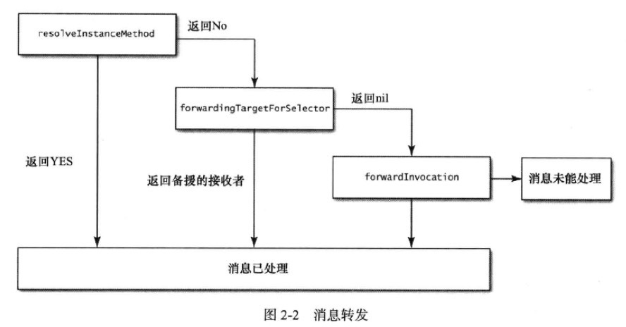

#理解消息转发机制

###主要内容
1. 详细转发的阶段:

	1. 征询接受者,看是否能动态添加方法
	2. 消息转发,首先查看有没有备援的接受者,若没有的话会生成一个Invocation对象,在函数中进行调用执行
	
	  
	
	接受者的每一步都有机会处理消息,步骤越往后,处理消息的代价就越大.最好能在第一步就处理完.
	第一步只需要动态生成选择子
	第二步要选择合适对象,来转发这个选择子
	第三发需要根据NSInvocation对象,进行执行操作
	
2. 动态方法解析:

	调用方法为:
	
		+(BOOL)resolveInstanceMethod:(SEL)selector
		
	在这个方法中,需要动态生成对象的选择子并添加到类中
	
3. 备援接受对象

	调用方法:
		
		+(id)forwardingTargetForSelector:(SEL)selector ;
	
	在这个方法中,我们需要selector来选择合适的调用对象,并返回
	
4. 完整的消息转发

	调用方法:
	
		- (void)forwardInvocation:(NSInvocation *)invocation ;
		
	在这个方法中传入了调用的相关信息,我们只需要改变调用目标,使消息在新目标上得以调用即可,当然我们也可以改变其他调用信息
	
	
###重点总结
* 若对象无法响应某个selector,则进入消息转发流程
* 通过运行期的动态方法解析功能,我们可以在需要用到某个放啊时再将其加入类中
* 对象可以把其无法解读的某些选择字转交给其他对象来处理
* 经过上述两步之后,如果还是没有办法处理selector,就启动完整的消息转发机制