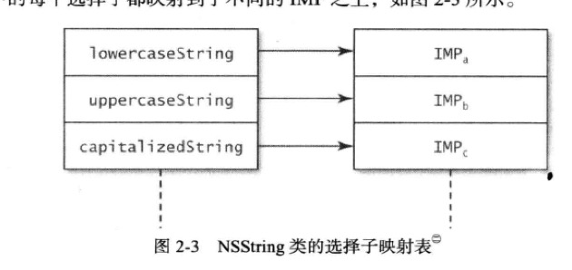
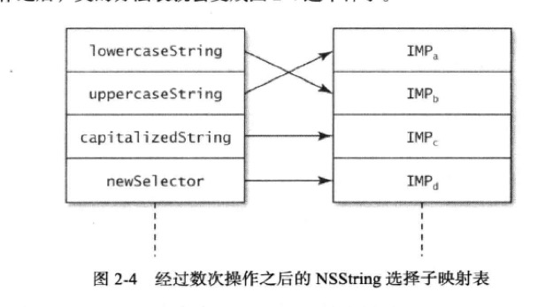

#用`方法调配技术`调试`黑盒方法`
###主要内容

1. 方法交换:

		void method_exchangeImplementations(Method m1,Method m2) ;
		
2. 方法获取:

		Method class_getInstanceMethod(Class aClass,SEL aSelector) ;
		
3. 交换的使用:

		Method originalMethod = class_getInstanceMethod([NSString class],@selector(lowercaseString)) ;
		Method swappedMethod = class_getInstanceMethod([NSString class],@selector(uppercaseString)) ;
		method_exchangeImplementations(originalMethod,swappedMethod) ;
		
	使用前:  
	  
	使用后:  
	
	
###要点总结
* 在运行期,可以向类中新增或替换selector对应方法的实现
* 使用另一分实现来替换原有的方法实现,这道工序叫做`方法调制`,开发者常用此技术向原有实现中添加新功能
* 一般来说,只有调试程序的时候才需要在运行期修改方法实现,这种做法不宜滥用
	