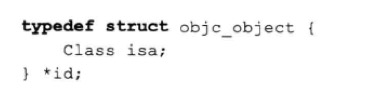
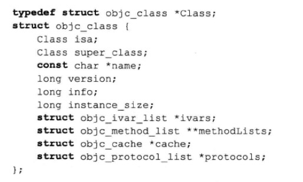
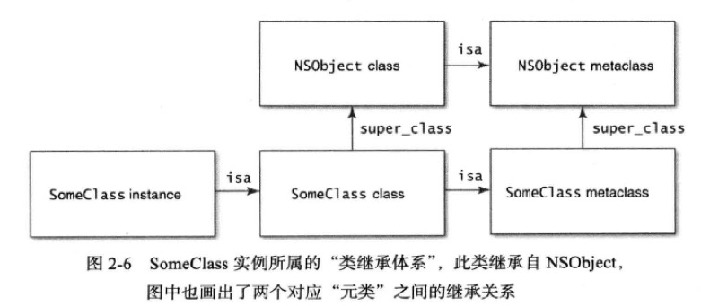

#理解`类对象`的用意
###主要内容
1. id类型的定义:  
	  
	Class对象的定义如下:  
	  
	可以看出每个对象内部含有一个`isa`指针,指向所属的类
	
2. 类的继承关系  
	对象`isa`指向所属的`class`,`class`对象`isa`指向`元类(metaclass)`  
	`class`对象仅有一个,因此是个单例

	
	
3. 在类继承体系中查询类型信息:

	查询类型信息主要有一下两个方法:
		
		isMemberOfClass:   // 判断对象是否为某个特定类的实例
		isKindeOfClass:   // 判断对象是否为某类或器派生类的实例
		
4. 类型的简单判断

		NSMutableDictionary *dict = [NSMutableDictionary new] ;
		[dict isMemberOfClass:[NSDictionary class]] ;   // NO
		[dict isMemberOfClass:[NSMutableDictionary class]] // YES
		[dict isKindOfClass:[NSDictionary class]] ;  // YES
		[dict isKindOfClass:[NSArray class]] ; // NO 
		

###要点总结
* 每个实例都有一个指向Class对象的指针,用以表明其类型,而这些Class对象则构成了类的继承体系
* 如果对象类型无法再编译器确定,那么就应该使用类型信息查询方法探知
* 尽量使用类型信息查询方法刘确定对象类型,而不要直接使用比较类对象,因为某些对象可能实现了消息转发功能