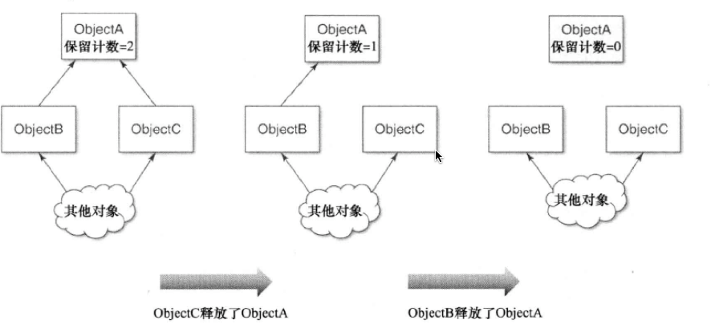

#理解引用计数
###主要内容
1. Objective-C语言使用`引用计数`来管理内存,也就是说,每个对象都有可以递增或递减的计数器

2. NSObject协议中声明的三个用于操作引用计数的签名:

		1. retain:递增引用计数
		2. release:递减引用计数
		3. autorelease:带稍后清理`自动释放池`,再递减引用计数
		
		
3. 引用计数简单流程:

	  
	
4. 内存管理的相关语句在ARC中是不能使用的

5. 在使用引用计数体制时,经常要注意的一个问题就是`保留环`,也就是呈环状相互引用多个对象,这将导致内存泄漏,因为循环中的对象引用计数不会降到0,通常用弱引用来解决此问题

###要点总结
* 引用计数机制通过可以递减的计数器来管理内存,对象创建好之后,其保留引用至少为1,如果引用计数为正,则对象会继续存活,当保留计数降为0时,对象就被销毁啦
* 在对象声明期中,其余对象通过引用来保留或释放此对象,保留与释放操作分别会递增机及递减保留计数