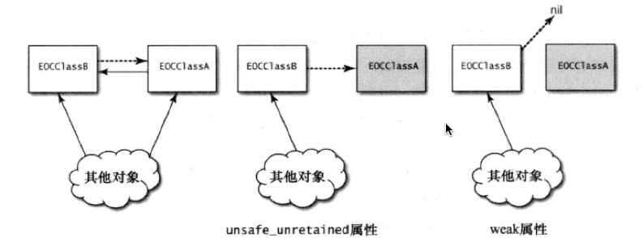

#以若引用避免保留环
###主要内容
1. 保留环会导致内存泄漏,如果只剩一个引用还指向保留环中的实例,而现在又把这个引用移除,那么整个保留环就泄漏啦.

2. 避免保留环的最佳方式是若引用,这种引用经常用来表示`非拥有关系`

3. unsafe_unretained与weak的区别  
	
	
4. 使用weak而非unsafe_unretained引用可以令代码更加安全

###要点总结
* 将某些引用设为`weak`,可避免出现`保留环`
* `weak`引用可以自动清空,也可以不自动清空.自动清空是随着ARC而引入的新特性,由运行期系统来实现.在具备自动清空功能的弱引用上,可以随意读取其数据,因为这种引用不会指向已经回收过的对象