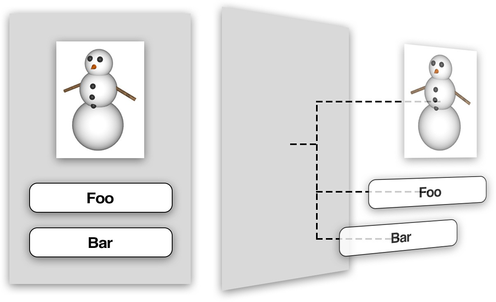
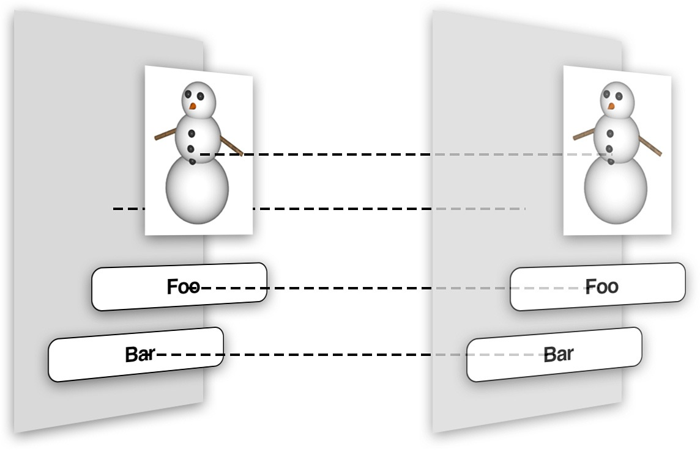
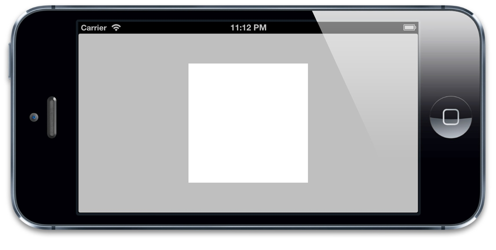
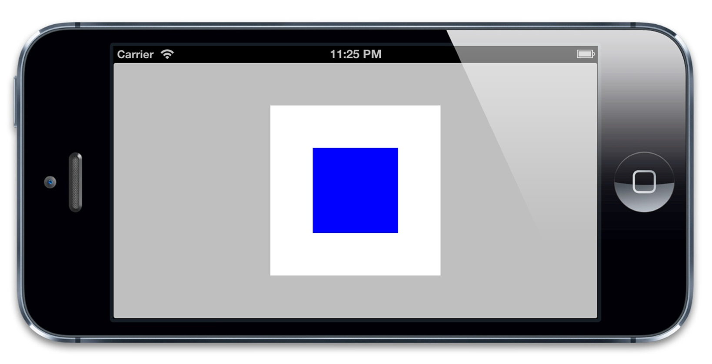

#图层树
----
###1. 图层与视图
`视图`:一个视图就是在屏幕上显示的一个矩形块（比如图片，文字或者视频），它能够拦截类似于鼠标点击或者触摸手势等用户输入。视图在层级关系中可以互相嵌套，一个视图可以管理它的所有子视图的位置,视图的层级关系如下所示:  
(左边是ios屏幕显示效果右边为层级关系):
  

###2. CALayer
`CALayer`类在概念上和`UIView`类似，同样也是一些被层级关系树管理的矩形块，同样也可以包含一些内容（像图片，文本或者背景色），管理子图层的位置。它们有一些方法和属性用来做动画和变换。和`UIView`最大的不同是`CALayer`不处理用户的交互。

`CALayer`并不清楚具体的*响应链*（iOS通过视图层级关系用来传送触摸事件的机制），于是它并不能够响应事件，即使它提供了一些方法来判断是否一个触点在图层的范围之内


###3. 平行的层级关系
每一个`UIview`都有一个`CALayer`实例的图层属性，也就是所谓的*backing layer*，视图的职责就是创建并管理这个图层，以确保当子视图在层级关系中添加或者被移除的时候，他们关联的图层也同样对应在层级关系树当中有相同的操作  
  
`UIView`仅仅是对图层的一个封装，提供了一些iOS类似于处理触摸的具体功能，以及Core Animation底层方法的高级接口。

###4. 图层的能力
对一些简单的需求来说，我们确实没必要处理`CALayer`，因为苹果已经通过`UIView`的高级API间接地使得动画变得很简单。  
但是这种简单会不可避免地带来一些灵活上的缺陷。如果你略微想在底层做一些改变，或者使用一些苹果没有在`UIView`上实现的接口功能，这时除了介入Core Animation底层之外别无选择。
以下是必须要用`CALayer`处理的功能:

* 阴影，圆角，带颜色的边框
* 3D变换
* 非矩形范围
* 透明遮罩
* 多级非线性动画

###5. 使用图层
我们可以简答的操作`CALayer`的属性,我们可以简单实现如下效果:
  
我们在代码中引用我们创建的View,之后就可以在代码中直接引用`CALayer`的属性和方法。设置了它的`backgroundColor`属性，然后添加到`layerView`背后相关图层的子图层

给视图添加一个蓝色子视图:
``` objective-c	
#import "ViewController.h"
#import <QuartzCore/QuartzCore.h>
@interface ViewController ()

@property (nonatomic, weak) IBOutlet UIView *layerView;

@end

@implementation ViewController

- (void)viewDidLoad
{
    [super viewDidLoad];
    //create sublayer
    CALayer *blueLayer = [CALayer layer];
    blueLayer.frame = CGRectMake(50.0f, 50.0f, 100.0f, 100.0f);
    blueLayer.backgroundColor = [UIColor blueColor].CGColor;
    //add it to our view
    [self.layerView.layer addSublayer:blueLayer];
}
@end
```   
 
效果如下:
  
一个视图只有一个相关联的图层（自动创建），同时它也可以支持添加无数多个子图层,如上代码我们实现了添加子视图,尽管可以这样添加图层，但往往我们只是见简单地处理视图，他们关联的图层并不需要额外地手动添加子图层。  
使用图层关联的视图而不是`CALayer`的好处在于，你能在使用所有`CALayer`底层特性的同时，也可以使用`UIView`的高级API（比如自动排版，布局和事件处理）  
然而下列情况下必须使用`CALayer`:  

* 开发同时可以在Mac OS上运行的跨平台应用
* 使用多种`CALayer`的子类（见第六章，“特殊的图层“），并且不想创建额外的`UIView`去包封装它们所有
* 做一些对性能特别挑剔的工作，比如对`UIView`一些可忽略不计的操作都会引起显著的不同（尽管如此，你可能会直接想使用OpenGL绘图）


