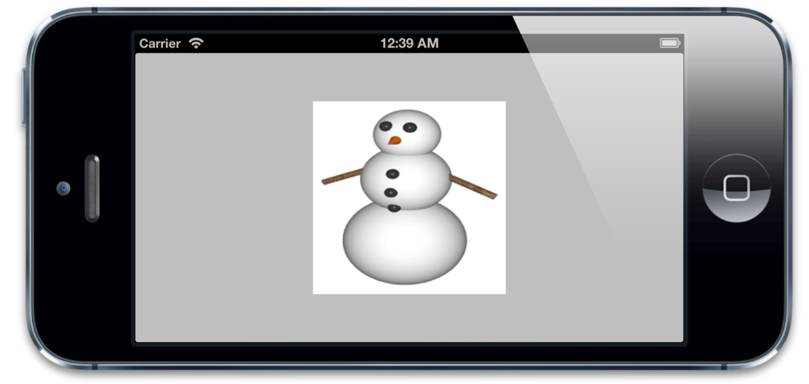
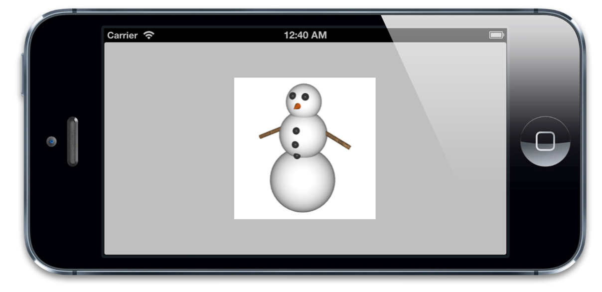
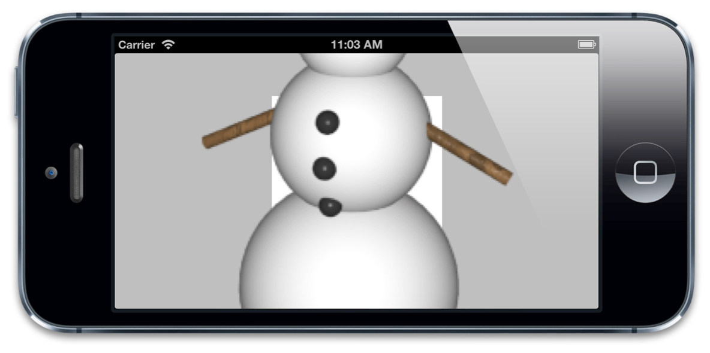
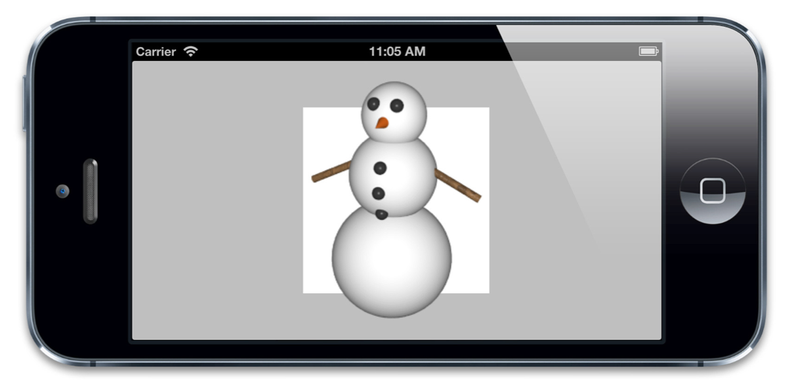
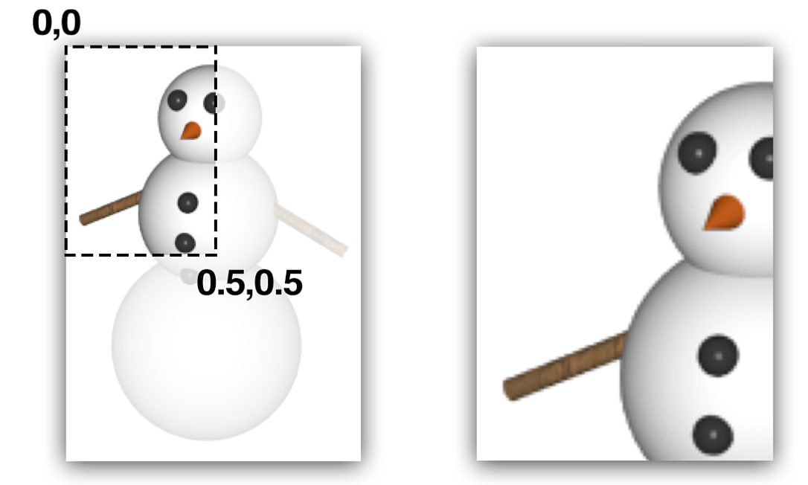
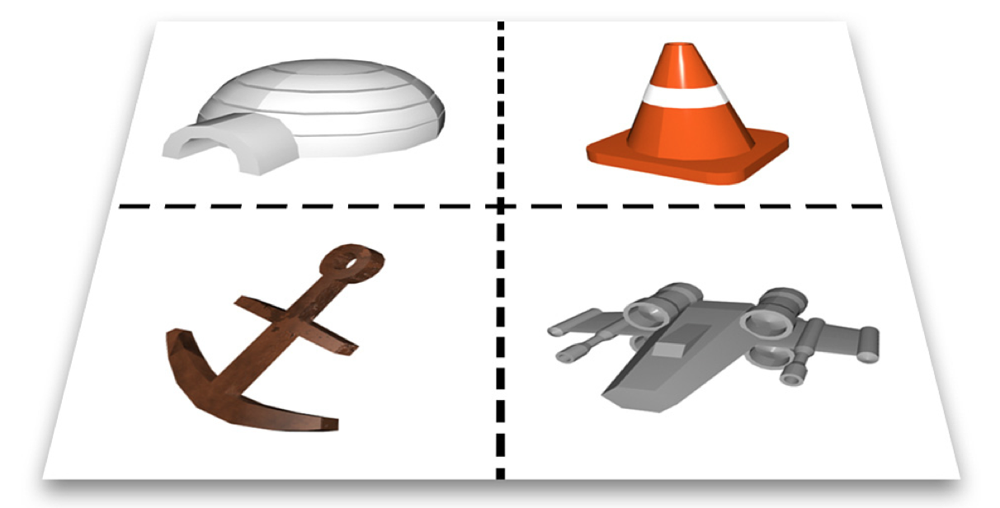
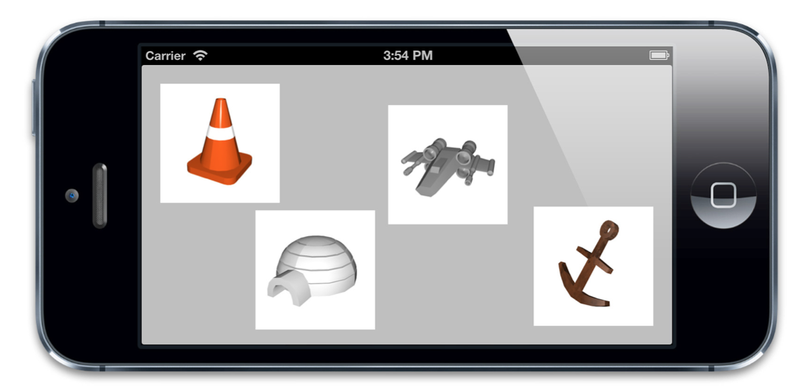
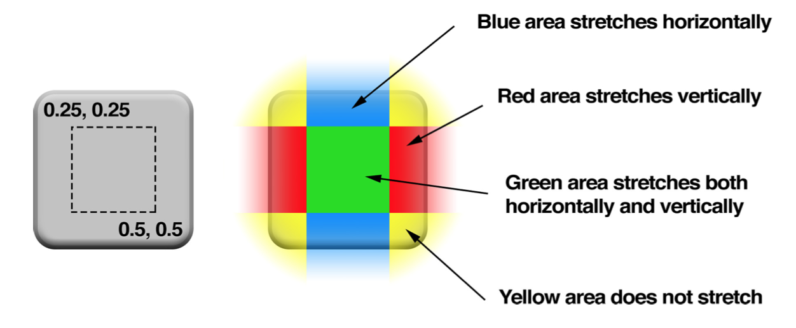
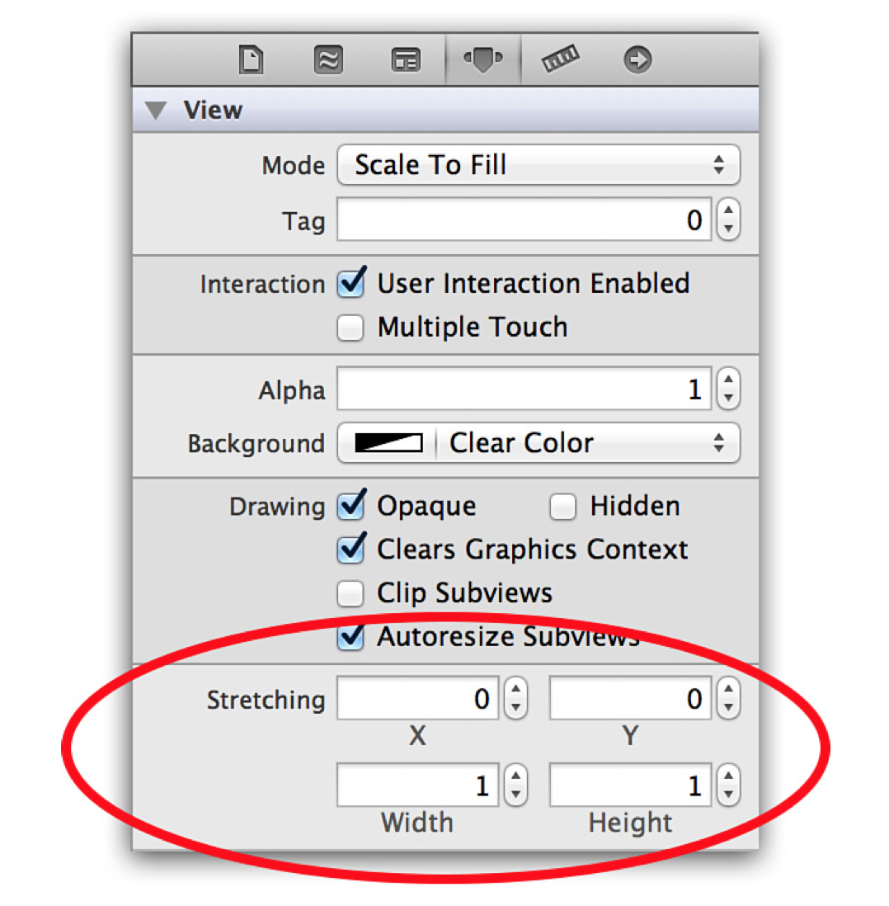

#寄宿图
---------------
###1. contents属性
CALayer 有一个属性叫做`contents`，这个属性的类型被定义为id，意味着它可以是任何类型的对象。在这种情况下，你可以给`contents`属性赋任何值，你的app仍然能够编译通过。但是，在实践中，如果你给`contents`赋的不是CGImage，那么你得到的图层将是空白的。  
事实上，你真正要赋值的类型应该是`CGImageRef`，它是一个指向`CGImage`结构的指针。UIImage有一个CGImage属性，它返回一个`CGImageRef`,如果你想把这个值直接赋值给CALayer的`contents`，那你将会得到一个编译错误。因为CGImageRef并不是一个真正的Cocoa对象，而是一个Core Foundation类型。  
尽管Core Foundation类型跟Cocoa对象在运行时貌似很像（被称作toll-free bridging），他们并不是类型兼容的，不过你可以通过bridged关键字转换。如果要给图层的寄宿图赋值，你可以按照以下这个方法:

``` objective-c
layer.contents = (__bridge id)image.CGImage;
```

我们现在可以对`CALayer`显示的内容进行设置,我们只需要把layerView的宿主图层的`contents`属性设置成图片。

``` objective-c
@implementation ViewController

- (void)viewDidLoad
{
  [super viewDidLoad]; //load an image
  UIImage *image = [UIImage imageNamed:@"Snowman.png"];

  //add it directly to our view's layer
  self.layerView.layer.contents = (__bridge id)image.CGImage;
}
@end
```

显示效果如下:
  

###2. contentGravity
我们可以明显的看出,加载的图片有明显的变形.我们加载的图片并不刚好是一个方的，为了适应这个视图，它有一点点被拉伸了。在使用UIImageView的时候遇到过同样的问题，解决方法就是把`contentMode`属性设置成更合适的值，像这样：  

```objective-c
view.contentMode = UIViewContentModeScaleAspectFit;
```

CALayer与`contentMode`对应的属性叫做`contentsGravity`，但是它是一个NSString类型，而不是像对应的UIKit部分，那里面的值是枚举。`contentsGravity`可选的常量值有以下一些：  

* kCAGravityCenter
* kCAGravityTop
* kCAGravityBottom
* kCAGravityLeft
* kCAGravityRight
* kCAGravityTopLeft
* kCAGravityTopRight
* kCAGravityBottomLeft
* kCAGravityBottomRight
* kCAGravityResize
* kCAGravityResizeAspect
* kCAGravityResizeAspectFill

通过CALayer设置效果:

```objective-c
self.layerView.layer.contentsGravity = kCAGravityResizeAspect;
```

  

###3. contentsScale
contentsScale属性定义了寄宿图的像素尺寸和视图大小的比例，默认情况下它是一个值为1.0的浮点数。  
`contentsScale`的目的并不是那么明显。它并不是总会对屏幕上的寄宿图有影响。如果你尝试对我们的例子设置不同的值，你就会发现根本没任何影响。因为contents由于设置了`contentsGravity`属性，所以它已经被拉伸以适应图层的边界  
如果contentsScale设置为1.0，将会以每个点1个像素绘制图片，如果设置为2.0，则会以每个点2个像素绘制图片，这就是我们熟知的Retina屏幕  
这并不会对我们在使用kCAGravityResizeAspect时产生任何影响，因为它就是拉伸图片以适应图层而已，根本不会考虑到分辨率问题。但是如果我们把contentsGravity设置为kCAGravityCenter（这个值并不会拉伸图片），那将会有很明显的变化
  

当我们使用UIImage类去读取我们的雪人图片的时候，他读取了高质量的Retina版本的图片。但是当我们用CGImage来设置我们的图层的内容时，拉伸这个因素在转换的时候就丢失了。不过我们可以通过手动设置contentsScale来修复这个问题

```objective-c
@implementation ViewController

- (void)viewDidLoad
{
  [super viewDidLoad]; //load an image
  UIImage *image = [UIImage imageNamed:@"Snowman.png"]; //add it directly to our view's layer
  self.layerView.layer.contents = (__bridge id)image.CGImage; //center the image
  self.layerView.layer.contentsGravity = kCAGravityCenter;

  //set the contentsScale to match image
  self.layerView.layer.contentsScale = image.scale;
}

@end
```

  

当用代码的方式来处理寄宿图的时候，一定要记住要手动的设置图层的`contentsScale`属性，否则，你的图片在Retina设备上就显示得不正确啦。代码如下：

```objective-c
layer.contentsScale = [UIScreen mainScreen].scale;
```

###4. maskToBounds
UIView有一个叫做`clipsToBounds`的属性可以用来决定是否显示超出边界的内容，CALayer对应的属性叫做`masksToBounds`，把它设置为YES,就不会显示边界外的内容了


###5. contentsRect
CALayer的`contentsRect`属性允许我们在图层边框里显示寄宿图的一个子域。这涉及到图片是如何显示和拉伸的，所以要比`contentsGravity`灵活多了  
和`bounds`，`frame`不同，`contentsRect`不是按点来计算的，它使用了*单位坐标*，单位坐标指定在0到1之间，是一个相对值
几个坐标系统如下所示:

* 点 —— 在iOS和Mac OS中最常见的坐标体系。点就像是虚拟的像素，也被称作逻辑像素。在标准设备上，一个点就是一个像素，但是在Retina设备上，一个点等于2*2个像素。iOS用点作为屏幕的坐标测算体系就是为了在Retina设备和普通设备上能有一致的视觉效果。
* 像素 —— 物理像素坐标并不会用来屏幕布局，但是仍然与图片有相对关系。UIImage是一个屏幕分辨率解决方案，所以指定点来度量大小。但是一些底层的图片表示如CGImage就会使用像素，所以你要清楚在Retina设备和普通设备上，他们表现出来了不同的大小。
* 单位 —— 对于与图片大小或是图层边界相关的显示，单位坐标是一个方便的度量方式， 当大小改变的时候，也不需要再次调整。单位坐标在OpenGL这种纹理坐标系统中用得很多，Core Animation中也用到了单位坐标。  

默认的contentsRect是{0, 0, 1, 1}，这意味着整个寄宿图默认都是可见的，如果我们指定一个小一点的矩形，图片就会被裁剪

  

`contentsRect`在app中最有趣的地方在于一个叫做*image sprites*（图片拼合）的用法。典型地，图片拼合后可以打包整合到一张大图上一次性载入。相比多次载入不同的图片，这样做能够带来很多方面的好处：内存使用，载入时间，渲染性能等等  
首先，我们需要一个拼合后的图表 —— 一个包含小一些的拼合图的大图片
  
接下来，我们要在app中载入并显示这些拼合图。规则很简单：像平常一样载入我们的大图，然后把它赋值给四个独立的图层的`contents`，然后设置每个图层的`contentsRect`来去掉我们不想显示的部分。  

```objective-c

@interface ViewController ()
@property (nonatomic, weak) IBOutlet UIView *coneView;
@property (nonatomic, weak) IBOutlet UIView *shipView;
@property (nonatomic, weak) IBOutlet UIView *iglooView;
@property (nonatomic, weak) IBOutlet UIView *anchorView;
@end

@implementation ViewController

- (void)addSpriteImage:(UIImage *)image withContentRect:(CGRect)rect toLayer:(CALayer *)layer //set image
{
  layer.contents = (__bridge id)image.CGImage;

  //scale contents to fit
  layer.contentsGravity = kCAGravityResizeAspect;

  //set contentsRect
  layer.contentsRect = rect;
}

- (void)viewDidLoad 
{
  [super viewDidLoad]; //load sprite sheet
  UIImage *image = [UIImage imageNamed:@"Sprites.png"];
  //set igloo sprite
  [self addSpriteImage:image withContentRect:CGRectMake(0, 0, 0.5, 0.5) toLayer:self.iglooView.layer];
  //set cone sprite
  [self addSpriteImage:image withContentRect:CGRectMake(0.5, 0, 0.5, 0.5) toLayer:self.coneView.layer];
  //set anchor sprite
  [self addSpriteImage:image withContentRect:CGRectMake(0, 0.5, 0.5, 0.5) toLayer:self.anchorView.layer];
  //set spaceship sprite
  [self addSpriteImage:image withContentRect:CGRectMake(0.5, 0.5, 0.5, 0.5) toLayer:self.shipView.layer];
}
@end
```

  

###6. contentsCenter

`contentsCenter`其实是一个CGRect，它定义了一个固定的边框和一个在图层上可拉伸的区域。 改变`contentsCenter`的值并不会影响到寄宿图的显示，除非这个图层的大小改变了，你才看得到效果。  
默认情况下，`contentsCenter`是{0, 0, 1, 1}，这意味着如果大小（由`conttensGravity`决定）改变了,那么寄宿图将会均匀地拉伸开。但是如果我们增加原点的值并减小尺寸。我们会在图片的周围创造一个边框
  

这意味着我们可以随意重设尺寸，边框仍然会是连续的。他工作起来的效果和UIImage里的-resizableImageWithCapInsets: 方法效果非常类似，只是它可以运用到任何寄宿图，甚至包括在Core Graphics运行时绘制的图形

同一图片使用不同的`contentsCenter`

```objective-c
@interface ViewController ()

@property (nonatomic, weak) IBOutlet UIView *button1;
@property (nonatomic, weak) IBOutlet UIView *button2;

@end

@implementation ViewController

- (void)addStretchableImage:(UIImage *)image withContentCenter:(CGRect)rect toLayer:(CALayer *)layer
{  
  //set image
  layer.contents = (__bridge id)image.CGImage;

  //set contentsCenter
  layer.contentsCenter = rect;
}

- (void)viewDidLoad
{
  [super viewDidLoad]; //load button image
  UIImage *image = [UIImage imageNamed:@"Button.png"];

  //set button 1
  [self addStretchableImage:image withContentCenter:CGRectMake(0.25, 0.25, 0.5, 0.5) toLayer:self.button1.layer];

  //set button 2
  [self addStretchableImage:image withContentCenter:CGRectMake(0.25, 0.25, 0.5, 0.5) toLayer:self.button2.layer];
}

@end
```

使用xib设置:



