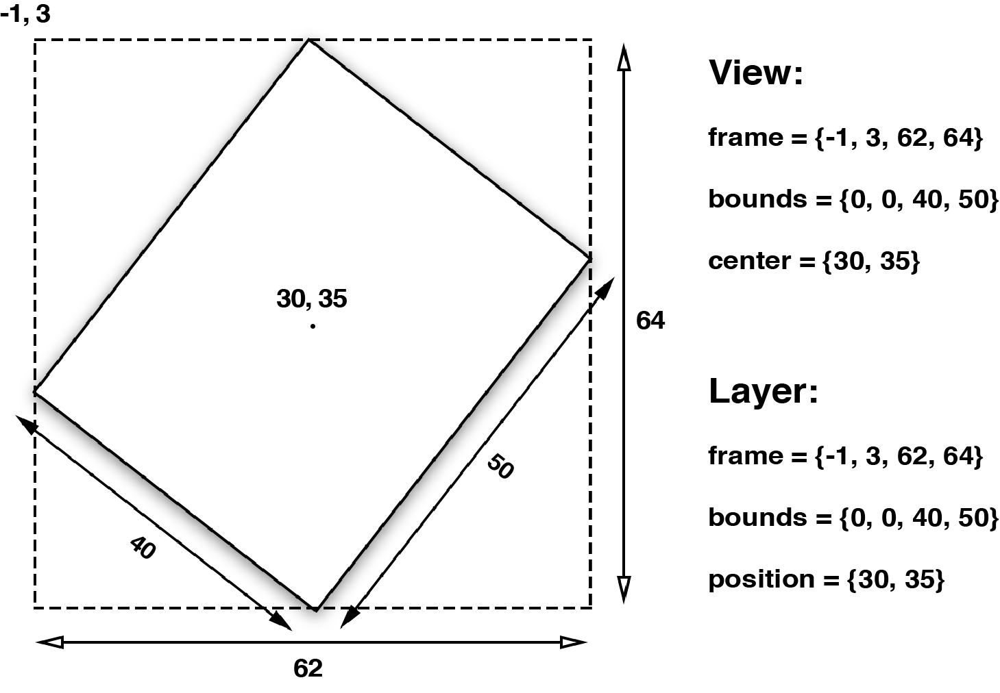

#图层几何学
=========
###1.布局
`UIView`有三个比较重要的布局属性：`frame`，`bounds`和`center`，`CALayer`对应地叫做`frame`，`bounds`和`position`。为了能清楚区分，图层用了“position”，视图用了“center”，但是他们都代表同样的值。  
`frame`代表了图层的外部坐标（也就是在父图层上占据的空间），`bounds`是内部坐标（{0, 0}通常是图层的左上角），`center`和`position`都代表了相对于父图层`anchorPoint`所在的位置。`anchorPoint`的属性将会在后续介绍到，现在把它想成图层的中心点就好了。图3.1显示了这些属性是如何相互依赖的。


视图的`frame`，`bounds`和`center`属性仅仅是*存取方法*，当操纵视图的`frame`，实际上是在改变位于视图下方`CALayer`的`frame`，不能够独立于图层之外改变视图的`frame`。


对于视图或者图层来说，`frame`并不是一个非常清晰的属性，它其实是一个虚拟属性，是根据`bounds`，`position`和`transform`计算而来，所以当其中任何一个值发生改变，frame都会变化。相反，改变frame的值同样会影响到他们当中的值

记住当对图层做变换的时候，比如旋转或者缩放，`frame`实际上代表了覆盖在图层旋转之后的整个轴对齐的矩形区域，也就是说`frame`的宽高可能和`bounds`的宽高不再一致了

 

###2. 锚点
视图的`center`属性和图层的`position`属性都指定了`anchorPoint`相对于父图层的位置。图层的`anchorPoint`通过`position`来控制它的`frame`的位置，你可以认为`anchorPoint`是用来移动图层的*把柄*。  
默认来说，`anchorPoint`位于图层的中点，所以图层的将会以这个点为中心放置。`anchorPoint`属性并没有被`UIView`接口暴露出来，这也是视图的position属性被叫做“center”的原因。但是图层的`anchorPoint`可以被移动，比如你可以把它置于图层`frame`的左上角，于是图层的内容将会向右下角的`position`方向移动，而不是居中了。  

  

`anchorPoint`用*单位坐标*来描述，也就是图层的相对坐标，图层左上角是{0, 0}，右下角是{1, 1}，因此默认坐标是{0.5, 0.5}。`anchorPoint`可以通过指定x和y值小于0或者大于1，使它放置在图层范围之外。

当改变了`anchorPoint`，`position`属性保持固定的值并没有发生改变，但是`frame`却移动了。

###3. 坐标系
和视图一样，图层在图层树当中也是相对于父图层按层级关系放置，一个图层的`position`依赖于它父图层的`bounds`，如果父图层发生了移动，它的所有子图层也会跟着移动。

这样对于放置图层会更加方便，因为你可以通过移动根图层来将它的子图层作为一个整体来移动，但是有时候你需要知道一个图层的*绝对*位置，或者是相对于另一个图层的位置，而不是它当前父图层的位置。

`CALayer`给不同坐标系之间的图层转换提供了一些工具类方法：

    - (CGPoint)convertPoint:(CGPoint)point fromLayer:(CALayer *)layer;
    - (CGPoint)convertPoint:(CGPoint)point toLayer:(CALayer *)layer;
    - (CGRect)convertRect:(CGRect)rect fromLayer:(CALayer *)layer;
	- (CGRect)convertRect:(CGRect)rect toLayer:(CALayer *)layer;

这些方法可以把定义在一个图层坐标系下的点或者矩形转换成另一个图层坐标系下的点或者矩形.

###4. 翻转的几何结构
常规说来，在iOS上，一个图层的`position`位于父图层的左上角，但是在Mac OS上，通常是位于左下角。Core Animation可以通过`geometryFlipped`属性来适配这两种情况，它决定了一个图层的坐标是否相对于父图层垂直翻转，是一个`BOOL`类型。在iOS上通过设置它为`YES`意味着它的子图层将会被垂直翻转，也就是将会沿着底部排版而不是通常的顶部（它的所有子图层也同理，除非把它们的`geometryFlipped`属性也设为`YES`）。

###5. Z坐标
和`UIView`严格的二维坐标系不同，`CALayer`存在于一个三维空间当中。除了我们已经讨论过的`position`和`anchorPoint`属性之外，`CALayer`还有另外两个属性，`zPosition`和`anchorPointZ`，二者都是在Z轴上描述图层位置的浮点类型。  
注意这里并没有更*深*的属性来描述由宽和高做成的`bounds`了，图层是一个完全扁平的对象，你可以把它们想象成类似于一页二维的坚硬的纸片，用胶水粘成一个空洞，就像三维结构的折纸一样。  
`zPosition`属性在大多数情况下其实并不常用。`zPosition`最实用的功能就是改变图层的*显示顺序*了。  
通常，图层是根据它们子图层的`sublayers`出现的顺序来类绘制的，这就是所谓的*画家的算法*--就像一个画家在墙上作画--后被绘制上的图层将会遮盖住之前的图层，但是通过增加图层的`zPosition`，就可以把图层向相机方向*前置*，于是它就在所有其他图层的*前面*了（或者至少是小于它的`zPosition`值的图层的前面）。

###6. Hit Testing
`CALayer`并不关心任何响应链事件，所以不能直接处理触摸事件或者手势。但是它有一系列的方法帮你处理事件：`-containsPoint:`和`-hitTest:`。  

` -containsPoint: `接受一个在本图层坐标系下的`CGPoint`，如果这个点在图层`frame`范围内就返回`YES`。  

```objective-c
@interface ViewController ()

@property (nonatomic, weak) IBOutlet UIView *layerView;
@property (nonatomic, weak) CALayer *blueLayer;

@end

@implementation ViewController

- (void)viewDidLoad
{
    [super viewDidLoad];
    //create sublayer
    self.blueLayer = [CALayer layer];
    self.blueLayer.frame = CGRectMake(50.0f, 50.0f, 100.0f, 100.0f);
    self.blueLayer.backgroundColor = [UIColor blueColor].CGColor;
    //add it to our view
    [self.layerView.layer addSublayer:self.blueLayer];
}

- (void)touchesBegan:(NSSet *)touches withEvent:(UIEvent *)event
{
    //get touch position relative to main view
    CGPoint point = [[touches anyObject] locationInView:self.view];
    //convert point to the white layer's coordinates
    point = [self.layerView.layer convertPoint:point fromLayer:self.view.layer];
    //get layer using containsPoint:
    if ([self.layerView.layer containsPoint:point]) {
        //convert point to blueLayer’s coordinates
        point = [self.blueLayer convertPoint:point fromLayer:self.layerView.layer];
        if ([self.blueLayer containsPoint:point]) {
            [[[UIAlertView alloc] initWithTitle:@"Inside Blue Layer"
                                        message:nil
                                       delegate:nil
                              cancelButtonTitle:@"OK"
                              otherButtonTitles:nil] show];
        } else {
            [[[UIAlertView alloc] initWithTitle:@"Inside White Layer"
                                        message:nil
                                       delegate:nil
                              cancelButtonTitle:@"OK"
                              otherButtonTitles:nil] show];
        }
    }
}

@end
```

`-hitTest:`方法同样接受一个`CGPoint`类型参数，而不是`BOOL`类型，它返回图层本身，或者包含这个坐标点的叶子节点图层这意味着不再需要像使用`-containsPoint:`那样，人工地在每个子图层变换或者测试点击的坐标。如果这个点在最外面图层的范围之外，则返回nil。具体使用`-hitTest:`方法被点击图层的代码如下:

```objective-c
- (void)touchesBegan:(NSSet *)touches withEvent:(UIEvent *)event
{
    //get touch position
    CGPoint point = [[touches anyObject] locationInView:self.view];
    //get touched layer
    CALayer *layer = [self.layerView.layer hitTest:point];
    //get layer using hitTest
    if (layer == self.blueLayer) {
        [[[UIAlertView alloc] initWithTitle:@"Inside Blue Layer"
                                    message:nil
                                   delegate:nil
                          cancelButtonTitle:@"OK"
                          otherButtonTitles:nil] show];
    } else if (layer == self.layerView.layer) {
        [[[UIAlertView alloc] initWithTitle:@"Inside White Layer"
                                    message:nil
                                   delegate:nil
                          cancelButtonTitle:@"OK"
                          otherButtonTitles:nil] show];
    }
}
```

###6. 自动布局
你可能用过`UIViewAutoresizingMask`类型的一些常量，应用于当父视图改变尺寸的时候，相应`UIView`的`frame`也跟着更新的场景（通常用于横竖屏切换）。  
当使用视图的时候，可以充分利用`UIView`类接口暴露出来的`UIViewAutoresizingMask`和`NSLayoutConstraint`API，但如果想随意控制`CALayer`的布局，就需要手工操作。最简单的方法就是使用`CALayerDelegate`如下函数：

    - (void)layoutSublayersOfLayer:(CALayer *)layer;

当图层的`bounds`发生改变，或者图层的`-setNeedsLayout`方法被调用的时候，这个函数将会被执行。这使得你可以手动地重新摆放或者重新调整子图层的大小，但是不能像`UIView`的`autoresizingMask`和`constraints`属性做到自适应屏幕旋转。

