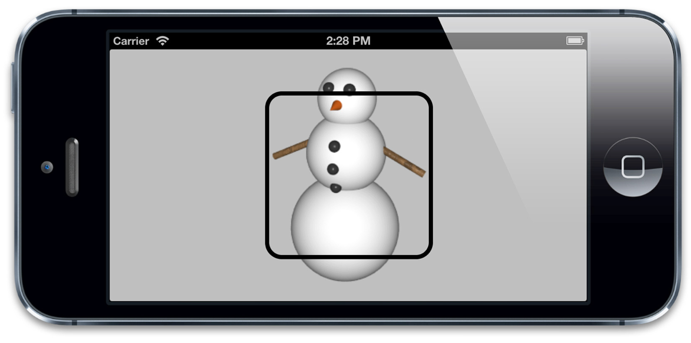

# 图层边框


&nbsp;&nbsp;&nbp;&nbsp;CALayer另外两个非常有用属性就是`borderWidth`和`borderColor`。二者共同定义了图层边的绘制样式。这条线（也被称作stroke）沿着图层的`bounds`绘制，同时也包含图层的角。

&nbsp;&nbsp;&nbp;&nbsp;`borderWidth`是以点为单位的定义边框粗细的浮点数，默认为0.`borderColor`定义了边框的颜色，默认为黑色。

&nbsp;&nbsp;&nbp;&nbsp;`borderColor`是CGColorRef类型，而不是UIColor，所以它不是Cocoa的内置对象。不过呢，你肯定也清楚图层引用了`borderColor`，虽然属性声明并不能证明这一点。`CGColorRef`在引用/释放时候的行为表现得与`NSObject`极其相似。但是Objective-C语法并不支持这一做法，所以`CGColorRef`属性即便是强引用也只能通过assign关键字来声明。

&nbsp;&nbsp;&nbp;&nbsp;边框是绘制在图层边界里面的，而且在所有子内容之前，也在子图层之前。如果我们在之前的示例中（清单4.2）加入图层的边框，你就能看到到底是怎么一回事了（如图4.3）.

清单4.2 加上边框

```objective-c
@implementation ViewController

- (void)viewDidLoad
{
  [super viewDidLoad];

  //set the corner radius on our layers
  self.layerView1.layer.cornerRadius = 20.0f;
  self.layerView2.layer.cornerRadius = 20.0f;

  //add a border to our layers
  self.layerView1.layer.borderWidth = 5.0f;
  self.layerView2.layer.borderWidth = 5.0f;

  //enable clipping on the second layer
  self.layerView2.layer.masksToBounds = YES;
}

@end
```


图4.3 给图层增加一个边框

&nbsp;&nbsp;&nbp;&nbsp;仔细观察会发现边框并不会把寄宿图或子图层的形状计算进来，如果图层的子图层超过了边界，或者是寄宿图在透明区域有一个透明蒙板，边框仍然会沿着图层的边界绘制出来（如图4.4）.



图4.4 边框是跟随图层的边界变化的，而不是图层里面的内容