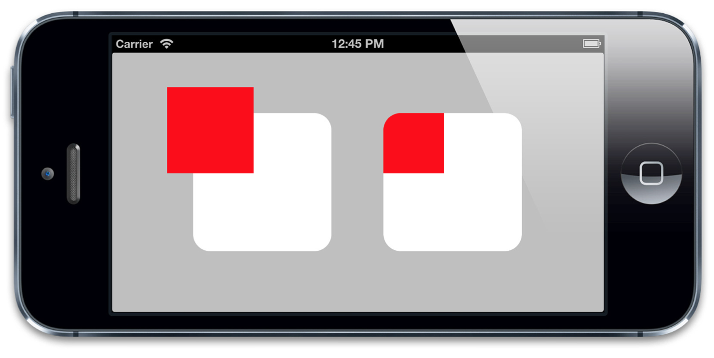
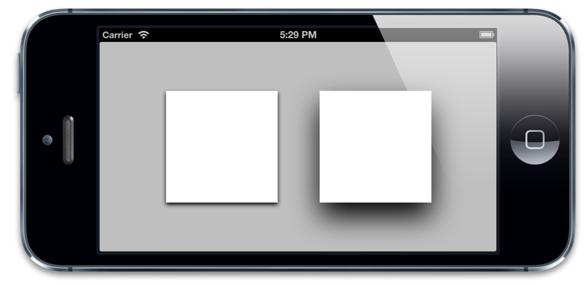
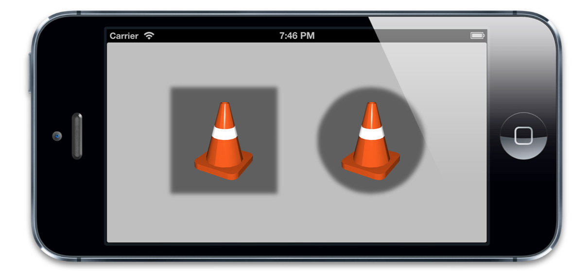
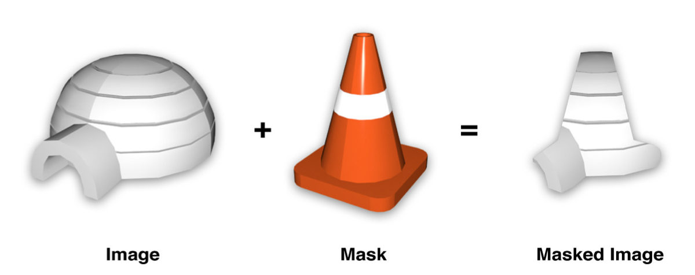
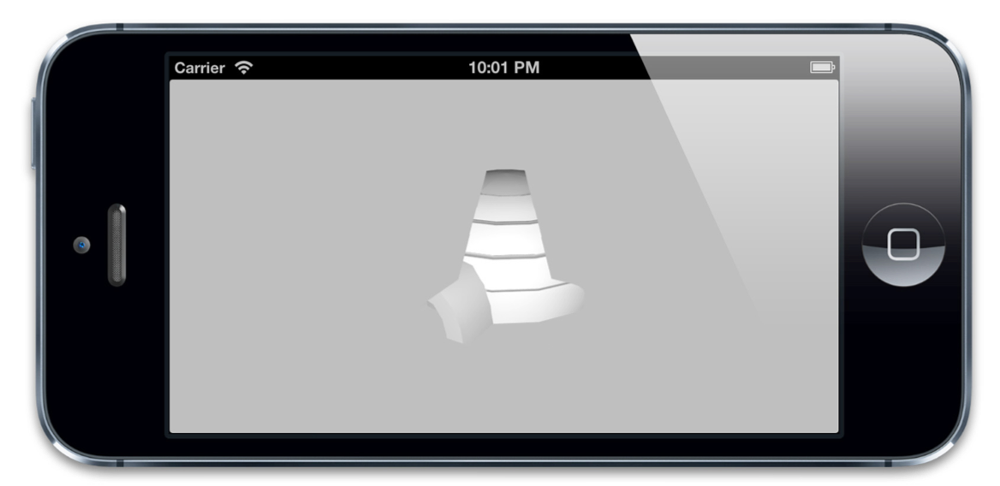

#视觉效果
========
###1. 圆角
圆角矩形是iOS的一个标志性审美特性。这在iOS的每一个地方都得到了体现，不论是主屏幕图标，还是警告弹框，甚至是文本框。  

CALayer有一个叫做`conrnerRadius`的属性控制着图层角的曲率。它是一个浮点数，默认为0（为0的时候就是直角），但是你可以把它设置成任意值。默认情况下，这个曲率值只影响背景颜色而不影响背景图片或是子图层。不过，如果把`masksToBounds`设置成YES的话，图层里面的所有东西都会被截取。  

```objective-c
@interface ViewController ()

@property (nonatomic, weak) IBOutlet UIView *layerView1;
@property (nonatomic, weak) IBOutlet UIView *layerView2;

@end

@implementation ViewController
- (void)viewDidLoad
{
  [super viewDidLoad];

  //set the corner radius on our layers
  self.layerView1.layer.cornerRadius = 20.0f;
  self.layerView2.layer.cornerRadius = 20.0f;

  //enable clipping on the second layer
  self.layerView2.layer.masksToBounds = YES;
}
@end
```



###2. 图层边框
CALayer另外两个非常有用属性就是`borderWidth`和`borderColor`。二者共同定义了图层边的绘制样式。这条线（也被称作stroke）沿着图层的`bounds`绘制，同时也包含图层的角。  
`borderWidth`是以点为单位的定义边框粗细的浮点数，默认为0.`borderColor`定义了边框的颜色，默认为黑色。  
`borderColor`是CGColorRef类型，而不是UIColor，所以它不是Cocoa的内置对象。不过呢，你肯定也清楚图层引用了`borderColor`，虽然属性声明并不能证明这一点。`CGColorRef`在引用/释放时候的行为表现得与`NSObject`极其相似。但是Objective-C语法并不支持这一做法，所以`CGColorRef`属性即便是强引用也只能通过assign关键字来声明。

```objective-c
@implementation ViewController

- (void)viewDidLoad
{
  [super viewDidLoad];

  //set the corner radius on our layers
  self.layerView1.layer.cornerRadius = 20.0f;
  self.layerView2.layer.cornerRadius = 20.0f;

  //add a border to our layers
  self.layerView1.layer.borderWidth = 5.0f;
  self.layerView2.layer.borderWidth = 5.0f;

  //enable clipping on the second layer
  self.layerView2.layer.masksToBounds = YES;
}

@end
```

###3. 阴影
iOS的另一个常见特性呢，就是阴影。阴影往往可以达到图层深度暗示的效果。也能够用来强调正在显示的图层和优先级（比如说一个在其他视图之前的弹出框），不过有时候他们只是单纯的装饰目的。

给`shadowOpacity`属性一个大于默认值（也就是0）的值，阴影就可以显示在任意图层之下。

`shadowOpacity`是一个必须在0.0（不可见）和1.0（完全不透明）之间的浮点数。如果设置为1.0，将会显示一个有轻微模糊的黑色阴影稍微在图层之上。若要改动阴影的表现，你可以使用CALayer的另外三个属性：`shadowColor`，`shadowOffset`和`shadowRadius`。

显而易见，`shadowColor`属性控制着阴影的颜色，和`borderColor`和`backgroundColor`一样，它的类型也是`CGColorRef`。阴影默认是黑色，大多数时候你需要的阴影也是黑色的

`shadowOffset`属性控制着阴影的方向和距离。它是一个`CGSize`的值，宽度控制这阴影横向的位移，高度控制着纵向的位移。`shadowOffset`的默认值是 {0, -3}，意即阴影相对于Y轴有3个点的向上位移。

`shadowRadius`属性控制着阴影的*模糊度*，当它的值是0的时候，阴影就和视图一样有一个非常确定的边界线。当值越来越大的时候，边界线看上去就会越来越模糊和自然。苹果自家的应用设计更偏向于自然的阴影，所以一个非零值再合适不过了。

通常来讲，如果你想让视图或控件非常醒目独立于背景之外（比如弹出框遮罩层），你就应该给`shadowRadius`设置一个稍大的值。阴影越模糊，图层的深度看上去就会更明显



###4. shadowPath属性
我们已经知道图层阴影并不总是方的，而是从图层内容的形状继承而来。这看上去不错，但是实时计算阴影也是一个非常消耗资源的，尤其是图层有多个子图层，每个图层还有一个有透明效果的寄宿图的时候。

如果你事先知道你的阴影形状会是什么样子的，你可以通过指定一个`shadowPath`来提高性能。`shadowPath`是一个`CGPathRef`类型（一个指向`CGPath`的指针）。`CGPath`是一个Core Graphics对象，用来指定任意的一个矢量图形。我们可以通过这个属性单独于图层形状之外指定阴影的形状。



```objective-c
@interface ViewController ()

@property (nonatomic, weak) IBOutlet UIView *layerView1;
@property (nonatomic, weak) IBOutlet UIView *layerView2;
@end

@implementation ViewController

- (void)viewDidLoad
{
  [super viewDidLoad];

  //enable layer shadows
  self.layerView1.layer.shadowOpacity = 0.5f;
  self.layerView2.layer.shadowOpacity = 0.5f;

  //create a square shadow
  CGMutablePathRef squarePath = CGPathCreateMutable();
  CGPathAddRect(squarePath, NULL, self.layerView1.bounds);
  self.layerView1.layer.shadowPath = squarePath; CGPathRelease(squarePath);

  //create a circular shadow
  CGMutablePathRef circlePath = CGPathCreateMutable();
  CGPathAddEllipseInRect(circlePath, NULL, self.layerView2.bounds);
  self.layerView2.layer.shadowPath = circlePath; CGPathRelease(circlePath);
}
@end
```

###5. 图层蒙板
通过`masksToBounds`属性，我们可以沿边界裁剪图形；通过`cornerRadius`属性，我们还可以设定一个圆角。但是有时候你希望展现的内容不是在一个矩形或圆角矩形。比如，你想展示一个有星形框架的图片，又或者想让一些古卷文字慢慢渐变成背景色，而不是一个突兀的边界。

CALayer有一个属性叫做`mask`可以解决这个问题。这个属性本身就是个CALayer类型，有和其他图层一样的绘制和布局属性。它类似于一个子图层，相对于父图层（即拥有该属性的图层）布局，但是它却不是一个普通的子图层。不同于那些绘制在父图层中的子图层，`mask`图层定义了父图层的部分可见区域。  

`mask`图层的`Color`属性是无关紧要的，真正重要的是图层的轮廓。`mask`属性就像是一个饼干切割机，`mask`图层实心的部分会被保留下来，其他的则会被抛弃



```objective-c
@interface ViewController ()

@property (nonatomic, weak) IBOutlet UIImageView *imageView;
@end

@implementation ViewController

- (void)viewDidLoad
{
  [super viewDidLoad];

  //create mask layer
  CALayer *maskLayer = [CALayer layer];
  maskLayer.frame = self.layerView.bounds;
  UIImage *maskImage = [UIImage imageNamed:@"Cone.png"];
  maskLayer.contents = (__bridge id)maskImage.CGImage;

  //apply mask to image layer
  self.imageView.layer.mask = maskLayer;
}
@end
```



CALayer蒙板图层真正厉害的地方在于蒙板图不局限于静态图。任何有图层构成的都可以作为`mask`属性，这意味着你的蒙板可以通过代码甚至是动画实时生成。

###6. 拉伸过滤
最后我们再来谈谈`minificationFilter`和`magnificationFilter`属性。总得来讲，当我们视图显示一个图片的时候，都应该正确地显示这个图片（意即：以正确的比例和正确的1：1像素显示在屏幕上）。原因如下：

* 能够显示最好的画质，像素既没有被压缩也没有被拉伸。
* 能更好的使用内存，因为这就是所有你要存储的东西。
* 最好的性能表现，CPU不需要为此额外的计算。

不过有时候，显示一个非真实大小的图片确实是我们需要的效果。比如说一个头像或是图片的缩略图，再比如说一个可以被拖拽和伸缩的大图。这些情况下，为同一图片的不同大小存储不同的图片显得又不切实际。

当图片需要显示不同的大小的时候，有一种叫做*拉伸过滤*的算法就起到作用了。它作用于原图的像素上并根据需要生成新的像素显示在屏幕上。

事实上，重绘图片大小也没有一个统一的通用算法。这取决于需要拉伸的内容，放大或是缩小的需求等这些因素。`CALayer`为此提供了三种拉伸过滤方法，他们是：

* kCAFilterLinear
* kCAFilterNearest
* kCAFilterTrilinear

minification（缩小图片）和magnification（放大图片）默认的过滤器都是`kCAFilterLinear`，这个过滤器采用双线性滤波算法，它在大多数情况下都表现良好。双线性滤波算法通过对多个像素取样最终生成新的值，得到一个平滑的表现不错的拉伸。但是当放大倍数比较大的时候图片就模糊不清了。

###7. 组透明
UIView有一个叫做`alpha`的属性来确定视图的透明度。CALayer有一个等同的属性叫做`opacity`，这两个属性都是影响子层级的。也就是说，如果你给一个图层设置了`opacity`属性，那它的子图层都会受此影响。

理想状况下，当你设置了一个图层的透明度，你希望它包含的整个图层树像一个整体一样的透明效果。你可以通过设置Info.plist文件中的`UIViewGroupOpacity`为YES来达到这个效果，但是这个设置会影响到这个应用，整个app可能会受到不良影响。如果`UIViewGroupOpacity`并未设置，iOS 6和以前的版本会默认为NO（也许以后的版本会有一些改变）。
