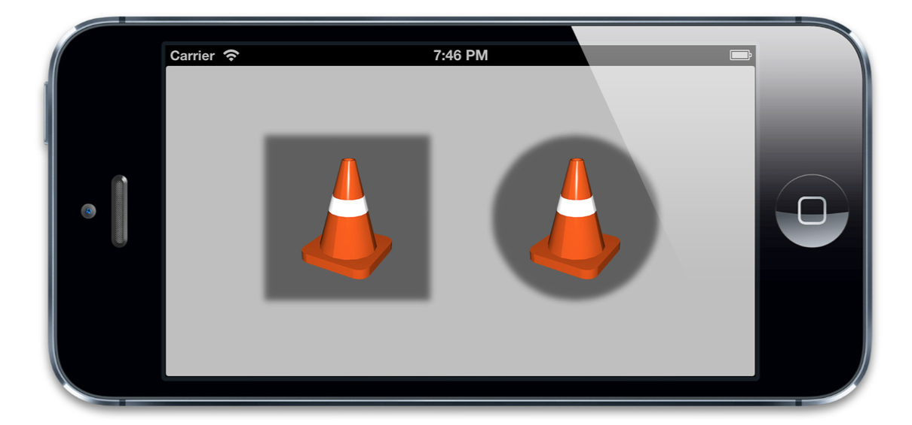

# shadowPath属性


&nbsp;&nbsp;&nbsp;&nbsp;我们已经知道图层阴影并不总是方的，而是从图层内容的形状继承而来。这看上去不错，但是实时计算阴影也是一个非常消耗资源的，尤其是图层有多个子图层，每个图层还有一个有透明效果的寄宿图的时候。

&nbsp;&nbsp;&nbsp;&nbsp;如果你事先知道你的阴影形状会是什么样子的，你可以通过指定一个`shadowPath`来提高性能。`shadowPath`是一个`CGPathRef`类型（一个指向`CGPath`的指针）。`CGPath`是一个Core Graphics对象，用来指定任意的一个矢量图形。我们可以通过这个属性单独于图层形状之外指定阴影的形状。

图4.11 展示了同一寄宿图的不同阴影设定。如你所见，我们使用的图形很简单，但是它的阴影可以是你想要的任何形状。清单4.4是代码实现。



图4.11 用`shadowPath`指定任意阴影形状

清单4.4 创建简单的阴影形状

```objective-c
@interface ViewController ()

@property (nonatomic, weak) IBOutlet UIView *layerView1;
@property (nonatomic, weak) IBOutlet UIView *layerView2;
@end

@implementation ViewController

- (void)viewDidLoad
{
  [super viewDidLoad];

  //enable layer shadows
  self.layerView1.layer.shadowOpacity = 0.5f;
  self.layerView2.layer.shadowOpacity = 0.5f;

  //create a square shadow
  CGMutablePathRef squarePath = CGPathCreateMutable();
  CGPathAddRect(squarePath, NULL, self.layerView1.bounds);
  self.layerView1.layer.shadowPath = squarePath; CGPathRelease(squarePath);

  //create a circular shadow
  CGMutablePathRef circlePath = CGPathCreateMutable();
  CGPathAddEllipseInRect(circlePath, NULL, self.layerView2.bounds);
  self.layerView2.layer.shadowPath = circlePath; CGPathRelease(circlePath);
}
@end
```

&nbsp;&nbsp;&nbsp;&nbsp;如果是一个矩形或者是圆，用`CGPath`会相当简单明了。但是如果是更加复杂一点的图形，`UIBezierPath`类会更合适，它是一个由UIKit提供的在CGPath基础上的Objective-C包装类。
