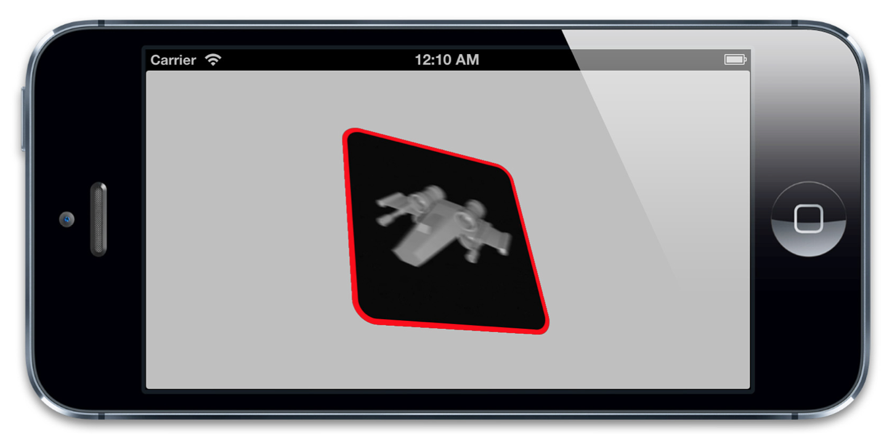

# AVPlayerLayer


最后一个图层类型是`AVPlayerLayer`。尽管它不是Core Animation框架的一部分（AV前缀看上去像），`AVPlayerLayer`是有别的框架（AVFoundation）提供的，它和Core Animation紧密地结合在一起，提供了一个`CALayer`子类来显示自定义的内容类型。

`AVPlayerLayer`是用来在iOS上播放视频的。他是高级接口例如`MPMoivePlayer`的底层实现，提供了显示视频的底层控制。`AVPlayerLayer`的使用相当简单：你可以用`+playerLayerWithPlayer:`方法创建一个已经绑定了视频播放器的图层，或者你可以先创建一个图层，然后用`player`属性绑定一个`AVPlayer`实例。

在我们开始之前，我们需要添加AVFoundation到我们的项目中。然后，清单6.15创建了一个简单的电影播放器，图6.16是代码运行结果。

清单6.15 用`AVPlayerLayer`播放视频

```objective-c
#import "ViewController.h"
#import <QuartzCore/QuartzCore.h>
#import <AVFoundation/AVFoundation.h>

@interface ViewController ()

@property (nonatomic, weak) IBOutlet UIView *containerView; @end

@implementation ViewController

- (void)viewDidLoad
{
    [super viewDidLoad];
    //get video URL
    NSURL *URL = [[NSBundle mainBundle] URLForResource:@"Ship" withExtension:@"mp4"];

    //create player and player layer
    AVPlayer *player = [AVPlayer playerWithURL:URL];
    AVPlayerLayer *playerLayer = [AVPlayerLayer playerLayerWithPlayer:player];

    //set player layer frame and attach it to our view
    playerLayer.frame = self.containerView.bounds;
    [self.containerView.layer addSublayer:playerLayer];

    //play the video
    [player play];
}
@end
```


图6.16 用`AVPlayerLayer`图层播放视频的截图

我们用代码创建了一个`AVPlayerLayer`，但是我们仍然把它添加到了一个容器视图中，而不是直接在controller中的主视图上添加。这样其实是为了可以使用自动布局限制使得图层在最中间；否则，一旦设备被旋转了我们就要手动重新放置位置，因为Core Animation并不支持自动大小和自动布局（见第三章『图层几何学』）。

当然，因为`AVPlayerLayer`是`CALayer`的子类，它继承了父类的所有特性。我们并不会受限于要在一个矩形中播放视频；清单6.16演示了在3D，圆角，有色边框，蒙板，阴影等效果（见图6.17）.

清单6.16 给视频增加变换，边框和圆角

```objective-c
- (void)viewDidLoad
{
    ...
    //set player layer frame and attach it to our view
    playerLayer.frame = self.containerView.bounds;
    [self.containerView.layer addSublayer:playerLayer];

    //transform layer
    CATransform3D transform = CATransform3DIdentity;
    transform.m34 = -1.0 / 500.0;
    transform = CATransform3DRotate(transform, M_PI_4, 1, 1, 0);
    playerLayer.transform = transform;
    
    //add rounded corners and border
    playerLayer.masksToBounds = YES;
    playerLayer.cornerRadius = 20.0;
    playerLayer.borderColor = [UIColor redColor].CGColor;
    playerLayer.borderWidth = 5.0;

    //play the video
    [player play];
}
```



图6.17 3D视角下的边框和圆角`AVPlayerLayer`
