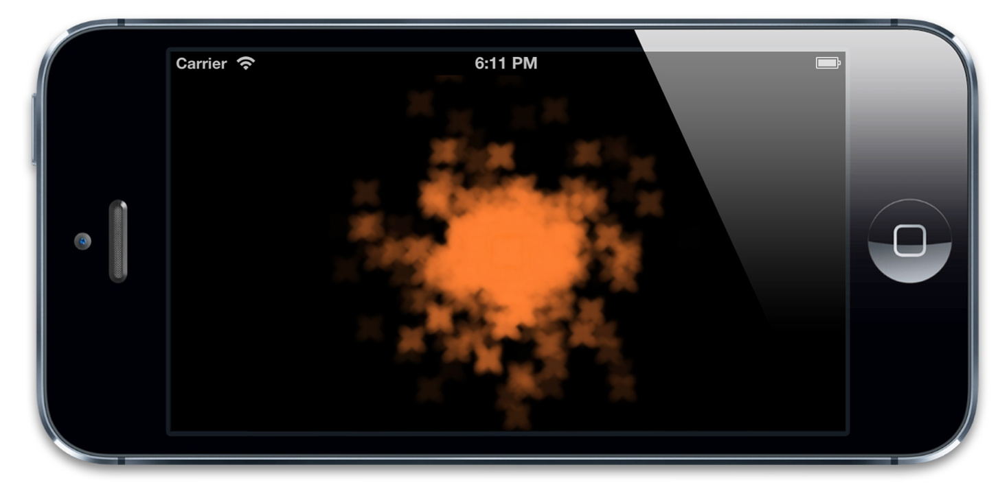

# CAEmitterLayer


在iOS 5中，苹果引入了一个新的`CALayer`子类叫做`CAEmitterLayer`。`CAEmitterLayer`是一个高性能的粒子引擎，被用来创建实时例子动画如：烟雾，火，雨等等这些效果。

`CAEmitterLayer`看上去像是许多`CAEmitterCell`的容器，这些`CAEmitierCell`定义了一个例子效果。你将会为不同的例子效果定义一个或多个`CAEmitterCell`作为模版，同时`CAEmitterLayer`负责基于这些模版实例化一个粒子流。一个`CAEmitterCell`类似于一个`CALayer`：它有一个`contents`属性可以定义为一个`CGImage`，另外还有一些可设置属性控制着表现和行为。我们不会对这些属性逐一进行详细的描述，你们可以在`CAEmitterCell`类的头文件中找到。

我们来举个例子。我们将利用在一圆中发射不同速度和透明度的粒子创建一个火爆炸的效果。清单6.13包含了生成爆炸的代码。图6.13是运行结果

清单6.13 用`CAEmitterLayer`创建爆炸效果

```objetive-c
#import "ViewController.h"
#import <QuartzCore/QuartzCore.h>

@interface ViewController ()

@property (nonatomic, weak) IBOutlet UIView *containerView;

@end


@implementation ViewController

- (void)viewDidLoad
{
    [super viewDidLoad];
    
    //create particle emitter layer
    CAEmitterLayer *emitter = [CAEmitterLayer layer];
    emitter.frame = self.containerView.bounds;
    [self.containerView.layer addSublayer:emitter];

    //configure emitter
    emitter.renderMode = kCAEmitterLayerAdditive;
    emitter.emitterPosition = CGPointMake(emitter.frame.size.width / 2.0, emitter.frame.size.height / 2.0);

    //create a particle template
    CAEmitterCell *cell = [[CAEmitterCell alloc] init];
    cell.contents = (__bridge id)[UIImage imageNamed:@"Spark.png"].CGImage;
    cell.birthRate = 150;
    cell.lifetime = 5.0;
    cell.color = [UIColor colorWithRed:1 green:0.5 blue:0.1 alpha:1.0].CGColor;
    cell.alphaSpeed = -0.4;
    cell.velocity = 50;
    cell.velocityRange = 50;
    cell.emissionRange = M_PI * 2.0;

    //add particle template to emitter
    emitter.emitterCells = @[cell];
}
@end
```

图6.13 火焰爆炸效果

`CAEMitterCell`的属性基本上可以分为三种：

* 这种粒子的某一属性的初始值。比如，`color`属性指定了一个可以混合图片内容颜色的混合色。在示例中，我们将它设置为桔色。
* 例子某一属性的变化范围。比如`emissionRange`属性的值是2π，这意味着例子可以从360度任意位置反射出来。如果指定一个小一些的值，就可以创造出一个圆锥形
* 指定值在时间线上的变化。比如，在示例中，我们将`alphaSpeed`设置为-0.4，就是说例子的透明度每过一秒就是减少0.4，这样就有发射出去之后逐渐小时的效果。

`CAEmitterLayer`的属性它自己控制着整个例子系统的位置和形状。一些属性比如`birthRate`，`lifetime`和`celocity`，这些属性在`CAEmitterCell`中也有。这些属性会以相乘的方式作用在一起，这样你就可以用一个值来加速或者扩大整个例子系统。其他值得提到的属性有以下这些：

* `preservesDepth`，是否将3D例子系统平面化到一个图层（默认值）或者可以在3D空间中混合其他的图层
* `renderMode`，控制着在视觉上粒子图片是如何混合的。你可能已经注意到了示例中我们把它设置为`kCAEmitterLayerAdditive`，它实现了这样一个效果：合并例子重叠部分的亮度使得看上去更亮。如果我们把它设置为默认的`kCAEmitterLayerUnordered`，效果就没那么好看了（见图6.14）.



图6.14 禁止混色之后的火焰粒子
