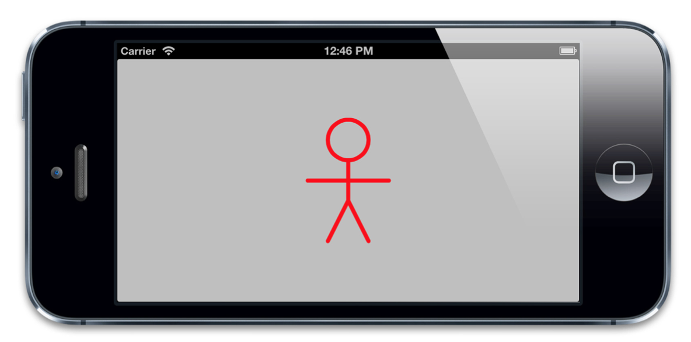

##CAShapeLayer

在第四章『视觉效果』我们学习到了不使用图片的情况下用`CGPath`去构造任意形状的阴影。如果我们能用同样的方式创建相同形状的图层就好了。

`CAShapeLayer`是一个通过矢量图形而不是bitmap来绘制的图层子类。你指定诸如颜色和线宽等属性，用`CGPath`来定义想要绘制的图形，最后`CAShapeLayer`就自动渲染出来了。当然，你也可以用Core Graphics直接向原始的`CALyer`的内容中绘制一个路径，相比直下，使用`CAShapeLayer`有以下一些优点：

* 渲染快速。`CAShapeLayer`使用了硬件加速，绘制同一图形会比用Core Graphics快很多。
* 高效使用内存。一个`CAShapeLayer`不需要像普通`CALayer`一样创建一个寄宿图形，所以无论有多大，都不会占用太多的内存。
* 不会被图层边界剪裁掉。一个`CAShapeLayer`可以在边界之外绘制。你的图层路径不会像在使用Core Graphics的普通`CALayer`一样被剪裁掉（如我们在第二章所见）。
* 不会出现像素化。当你给`CAShapeLayer`做3D变换时，它不像一个有寄宿图的普通图层一样变得像素化。

###创建一个`CGPath`

`CAShapeLayer`可以用来绘制所有能够通过`CGPath`来表示的形状。这个形状不一定要闭合，图层路径也不一定要不可破，事实上你可以在一个图层上绘制好几个不同的形状。你可以控制一些属性比如`lineWith`（线宽，用点表示单位），`lineCap`（线条结尾的样子），和`lineJoin`（线条之间的结合点的样子）；但是在图层层面你只有一次机会设置这些属性。如果你想用不同颜色或风格来绘制多个形状，就不得不为每个形状准备一个图层了。

清单6.1 的代码用一个`CAShapeLayer`渲染一个简单的火柴人。`CAShapeLayer`属性是`CGPathRef`类型，但是我们用`UIBezierPath`帮助类创建了图层路径，这样我们就不用考虑人工释放`CGPath`了。图6.1是代码运行的结果。虽然还不是很完美，但是总算知道了大意对吧！

清单6.1 用`CAShapeLayer`绘制一个火柴人

```objective-c
#import "DrawingView.h"
#import <QuartzCore/QuartzCore.h>

@interface ViewController ()

@property (nonatomic, weak) IBOutlet UIView *containerView;

@end

@implementation ViewController

- (void)viewDidLoad
{
  [super viewDidLoad];
  //create path
  UIBezierPath *path = [[UIBezierPath alloc] init];
  [path moveToPoint:CGPointMake(175, 100)];
  
  [path addArcWithCenter:CGPointMake(150, 100) radius:25 startAngle:0 endAngle:2*M_PI clockwise:YES];
  [path moveToPoint:CGPointMake(150, 125)];
  [path addLineToPoint:CGPointMake(150, 175)];
  [path addLineToPoint:CGPointMake(125, 225)];
  [path moveToPoint:CGPointMake(150, 175)];
  [path addLineToPoint:CGPointMake(175, 225)];
  [path moveToPoint:CGPointMake(100, 150)];
  [path addLineToPoint:CGPointMake(200, 150)];

  //create shape layer
  CAShapeLayer *shapeLayer = [CAShapeLayer layer];
  shapeLayer.strokeColor = [UIColor redColor].CGColor;
  shapeLayer.fillColor = [UIColor clearColor].CGColor;
  shapeLayer.lineWidth = 5;
  shapeLayer.lineJoin = kCALineJoinRound;
  shapeLayer.lineCap = kCALineCapRound;
  shapeLayer.path = path.CGPath;
  //add it to our view
  [self.containerView.layer addSublayer:shapeLayer];
}
@end
```



图6.1 用`CAShapeLayer`绘制一个简单的火柴人

###圆角

第二章里面提到了`CAShapeLayer`为创建圆角视图提供了一个方法，就是`CALayer`的`cornerRadius`属性（译者注：其实是在第四章提到的）。虽然使用`CAShapeLayer`类需要更多的工作，但是它有一个优势就是可以单独指定每个角。

我们创建圆角矩形其实就是人工绘制单独的直线和弧度，但是事实上`UIBezierPath`有自动绘制圆角矩形的构造方法，下面这段代码绘制了一个有三个圆角一个直角的矩形：

```objective-c
//define path parameters
CGRect rect = CGRectMake(50, 50, 100, 100);
CGSize radii = CGSizeMake(20, 20);
UIRectCorner corners = UIRectCornerTopRight | UIRectCornerBottomRight | UIRectCornerBottomLeft;
//create path
UIBezierPath *path = [UIBezierPath bezierPathWithRoundedRect:rect byRoundingCorners:corners cornerRadii:radii];
```

我们可以通过这个图层路径绘制一个既有直角又有圆角的视图。如果我们想依照此图形来剪裁视图内容，我们可以把`CAShapeLayer`作为视图的宿主图层，而不是添加一个子视图（图层蒙板的详细解释见第四章『视觉效果』）。
