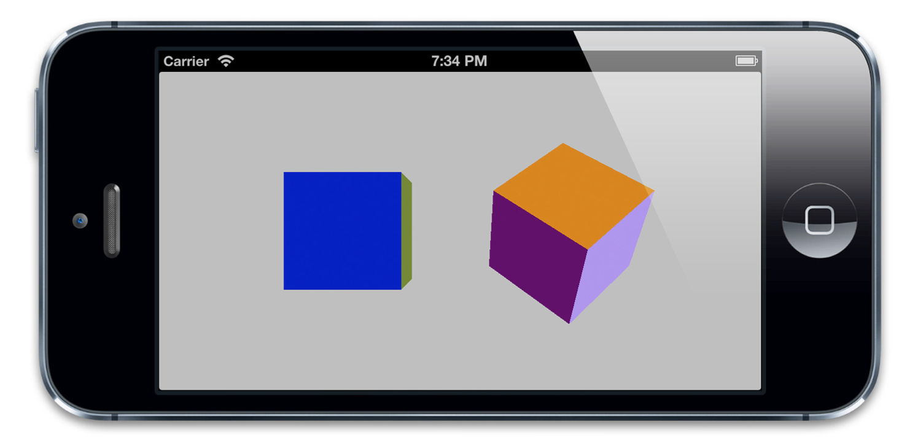

## CATransformLayer

当我们在构造复杂的3D事物的时候，如果能够组织独立元素就太方便了。比如说，你想创造一个孩子的手臂：你就需要确定哪一部分是孩子的手腕，哪一部分是孩子的前臂，哪一部分是孩子的肘，哪一部分是孩子的上臂，哪一部分是孩子的肩膀等等。

当然是允许独立地移动每个区域的啦。以肘为指点会移动前臂和手，而不是肩膀。Core Animation图层很容易就可以让你在2D环境下做出这样的层级体系下的变换，但是3D情况下就不太可能，因为所有的图层都把他的孩子都平面化到一个场景中（第五章『变换』有提到）。

`CATransformLayer`解决了这个问题，`CATransformLayer`不同于普通的`CALayer`，因为它不能显示它自己的内容。只有当存在了一个能作用域子图层的变换它才真正存在。`CATransformLayer`并不平面化它的子图层，所以它能够用于构造一个层级的3D结构，比如我的手臂示例。

用代码创建一个手臂需要相当多的代码，所以我就演示得更简单一些吧：在第五章的立方体示例，我们将通过旋转`camara`来解决图层平面化问题而不是像立方体示例代码中用的`sublayerTransform`。这是一个非常不错的技巧，但是只能作用域单个对象上，如果你的场景包含两个立方体，那我们就不能用这个技巧单独旋转他们了。

那么，就让我们来试一试`CATransformLayer`吧，第一个问题就来了：在第五章，我们是用多个视图来构造了我们的立方体，而不是单独的图层。我们不能在不打乱已有的视图层次的前提下在一个本身不是有寄宿图的图层中放置一个寄宿图图层。我们可以创建一个新的`UIView`子类寄宿在`CATransformLayer`（用`+layerClass`方法）之上。但是，为了简化案例，我们仅仅重建了一个单独的图层，而不是使用视图。这意味着我们不能像第五章一样在立方体表面显示按钮和标签，不过我们现在也用不到这个特性。

清单6.5就是代码。我们以我们在第五章使用过的相同基本逻辑放置立方体。但是并不像以前那样直接将立方面添加到容器视图的宿主图层，我们将他们放置到一个`CATransformLayer`中创建一个独立的立方体对象，然后将两个这样的立方体放进容器中。我们随机地给立方面染色以将他们区分开来，这样就不用靠标签或是光亮来区分他们。图6.5是运行结果。

清单6.5 用`CATransformLayer`装配一个3D图层体系

```objective-c
@interface ViewController ()

@property (nonatomic, weak) IBOutlet UIView *containerView;

@end

@implementation ViewController

- (CALayer *)faceWithTransform:(CATransform3D)transform
{
  //create cube face layer
  CALayer *face = [CALayer layer];
  face.frame = CGRectMake(-50, -50, 100, 100);

  //apply a random color
  CGFloat red = (rand() / (double)INT_MAX);
  CGFloat green = (rand() / (double)INT_MAX);
  CGFloat blue = (rand() / (double)INT_MAX);
  face.backgroundColor = [UIColor colorWithRed:red green:green blue:blue alpha:1.0].CGColor;

  //apply the transform and return
  face.transform = transform;
  return face;
}

- (CALayer *)cubeWithTransform:(CATransform3D)transform
{
  //create cube layer
  CATransformLayer *cube = [CATransformLayer layer];

  //add cube face 1
  CATransform3D ct = CATransform3DMakeTranslation(0, 0, 50);
  [cube addSublayer:[self faceWithTransform:ct]];

  //add cube face 2
  ct = CATransform3DMakeTranslation(50, 0, 0);
  ct = CATransform3DRotate(ct, M_PI_2, 0, 1, 0);
  [cube addSublayer:[self faceWithTransform:ct]];

  //add cube face 3
  ct = CATransform3DMakeTranslation(0, -50, 0);
  ct = CATransform3DRotate(ct, M_PI_2, 1, 0, 0);
  [cube addSublayer:[self faceWithTransform:ct]];

  //add cube face 4
  ct = CATransform3DMakeTranslation(0, 50, 0);
  ct = CATransform3DRotate(ct, -M_PI_2, 1, 0, 0);
  [cube addSublayer:[self faceWithTransform:ct]];

  //add cube face 5
  ct = CATransform3DMakeTranslation(-50, 0, 0);
  ct = CATransform3DRotate(ct, -M_PI_2, 0, 1, 0);
  [cube addSublayer:[self faceWithTransform:ct]];

  //add cube face 6
  ct = CATransform3DMakeTranslation(0, 0, -50);
  ct = CATransform3DRotate(ct, M_PI, 0, 1, 0);
  [cube addSublayer:[self faceWithTransform:ct]];

  //center the cube layer within the container
  CGSize containerSize = self.containerView.bounds.size;
  cube.position = CGPointMake(containerSize.width / 2.0, containerSize.height / 2.0);

  //apply the transform and return
  cube.transform = transform;
  return cube;
}

- (void)viewDidLoad
{
  [super viewDidLoad];

  //set up the perspective transform
  CATransform3D pt = CATransform3DIdentity;
  pt.m34 = -1.0 / 500.0;
  self.containerView.layer.sublayerTransform = pt;

  //set up the transform for cube 1 and add it
  CATransform3D c1t = CATransform3DIdentity;
  c1t = CATransform3DTranslate(c1t, -100, 0, 0);
  CALayer *cube1 = [self cubeWithTransform:c1t];
  [self.containerView.layer addSublayer:cube1];

  //set up the transform for cube 2 and add it
  CATransform3D c2t = CATransform3DIdentity;
  c2t = CATransform3DTranslate(c2t, 100, 0, 0);
  c2t = CATransform3DRotate(c2t, -M_PI_4, 1, 0, 0);
  c2t = CATransform3DRotate(c2t, -M_PI_4, 0, 1, 0);
  CALayer *cube2 = [self cubeWithTransform:c2t];
  [self.containerView.layer addSublayer:cube2];
}
@end
```



图6.5 同一视角下的俩不同变换的立方体
